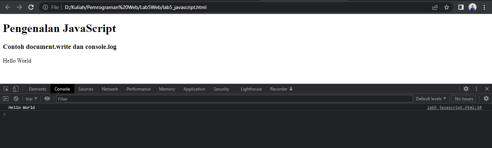
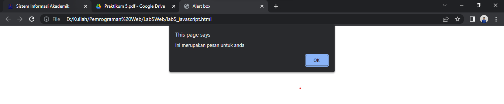
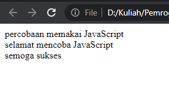

# Lab5Web

**Nama : Fery Affandi** <br>
**NIM : 312010018** <br>

# Praktikum 5 : JavaScript
## Langkah-langkah

Persiapkan dokumen HTML dengan nama <b>lab5_javascript.html </b> seperti berikut

```html
<!DOCTYPE html>
<html lang="en">
<head>
    <meta charset="UTF-8">
    <meta http-equiv="X-UA-Compatible" content="IE=edge">
    <meta name="viewport" content="width=device-width, initial-scale=1.0">
    <title>Mengenal JavaScript</title>
</head>
<body>
    <h1>Pengenalan JavaScript</h1>
    <h3>Contoh document.write dan console.log</h3>
    <script>
        document.write("Hello World");
        console.log("Hello World");
    </script>
</body>
</html>
```

<p align="center">Gambar 5.1 Tampilan Contoh Javascript

<br>

## Javascrip Dasar

Pemakaian Alert sebagai property window.
```html
<!DOCTYPE html>
<html lang="en">
<head>
    <meta charset="UTF-8">
    <meta http-equiv="X-UA-Compatible" content="IE=edge">
    <meta name="viewport" content="width=device-width, initial-scale=1.0">
    <title>Alert box </title>
</head>
<body>
    <script language = "JavaScript">
        <!-- 
        window.alert("ini merupakan pesan untuk anda");
        //-->
    </script>
</body>
</html>
```


<p align="center">Gambar 5.2 Tampilan Alert

Pemakaian method dalam objek

```html
<!DOCTYPE html>
<html lang="en">
<head>
    <meta charset="U>TF-8">
    <meta http-equiv="X-UA-Compatible" content="IE=edge"
    <meta name="viewport" content="width=device-width, initial-scale=1.0">
    <title>skrip JavaScript</title>
</head>
<body>
    percobaan memakai JavaScript <br>
    <script language = "JavaScript">
        <!-- 
        document.write("selamat mencoba JavaScript<br>");
        document.write("semoga sukses");
        //-->
    </script>
</body>
</html>
```


<p align="center">Gambar 5.3 Tampilan method

pemakaian  Prompt