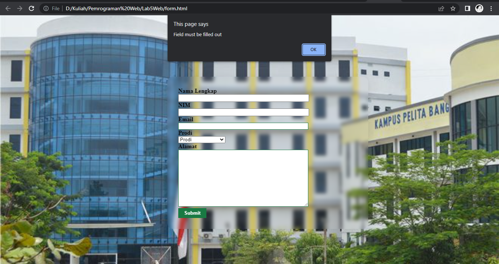

# Lab5Web

**Nama : Fery Affandi** <br>
**NIM : 312010018** <br>

# Praktikum 5 : JavaScript
## Langkah-langkah

Persiapkan dokumen HTML dengan nama <b>lab5_javascript.html </b> seperti berikut

```html
<!DOCTYPE html>
<html lang="en">
<head>
    <meta charset="UTF-8">
    <meta http-equiv="X-UA-Compatible" content="IE=edge">
    <meta name="viewport" content="width=device-width, initial-scale=1.0">
    <title>Mengenal JavaScript</title>
</head>
<body>
    <h1>Pengenalan JavaScript</h1>
    <h3>Contoh document.write dan console.log</h3>
    <script>
        document.write("Hello World");
        console.log("Hello World");
    </script>
</body>
</html>
```

<p align="center">Gambar 5.1 Tampilan Contoh Javascript

<br>

## Javascrip Dasar

Pemakaian Alert sebagai property window.
```html
<!DOCTYPE html>
<html lang="en">
<head>
    <meta charset="UTF-8">
    <meta http-equiv="X-UA-Compatible" content="IE=edge">
    <meta name="viewport" content="width=device-width, initial-scale=1.0">
    <title>Alert box </title>
</head>
<body>
    <script language = "JavaScript">
        <!-- 
        window.alert("ini merupakan pesan untuk anda");
        //-->
    </script>
</body>
</html>
```


<p align="center">Gambar 5.2 Tampilan Alert

Pemakaian method dalam objek

```html
<!DOCTYPE html>
<html lang="en">
<head>
    <meta charset="U>TF-8">
    <meta http-equiv="X-UA-Compatible" content="IE=edge"
    <meta name="viewport" content="width=device-width, initial-scale=1.0">
    <title>skrip JavaScript</title>
</head>
<body>
    percobaan memakai JavaScript <br>
    <script language = "JavaScript">
        <!-- 
        document.write("selamat mencoba JavaScript<br>");
        document.write("semoga sukses");
        //-->
    </script>
</body>
</html>
```


<p align="left">Gambar 5.3 Tampilan method

pemakaian  Prompt

```html
<!DOCTYPE html>
<html lang="en">
<head>
    <meta charset="U>TF-8">
    <meta http-equiv="X-UA-Compatible" content="IE=edge"
    <meta name="viewport" content="width=device-width, initial-scale=1.0">
    <title>Pemasukan Data</title>
</head>
<body>
    <script language = "JavaScript">
        <!-- 
            var nama = prompt("siapa nama anda?","masukan nama anda");  
            document.write("hai, " + nama);
        //-->
    </script>
</body>
</html>
```


<p align="center">Gambar 5.4
<br>


<p align="center">Gambar 5.5

Pembuatan fungsi dan cara pemanggilannya

```html
<!DOCTYPE html>
<html lang="en">
<head>
    <meta charset="U>TF-8">
    <meta http-equiv="X-UA-Compatible" content="IE=edge"
    <meta name="viewport" content="width=device-width, initial-scale=1.0">
    <title>Contoh Program JavaScript</title>
    <script lang="Javascript">
        function pesan (){
            alert ("memanggil javascript lewat body onload")
        }
    </script>
</head>
<body
    onload="pesan()">
</body>
</html>
```


<p align="center">Gambar 5.6

## Dasar Pemrograman Di Javascript

Operasi dasar aritmatika
``` html <br>
<!DOCTYPE html>
<html lang="en">
    <head>
        <title>contoh program javascript</title>
        <script language = "javascript">
            function test(val1,val2)
            {
                document.write("<br>"+"perkalian : val1*val2"+"<br>")
                document.write(val1*val2)
                document.write("<br>"+"pembagian : val1/val2"+"<br>")
                document.write(val1/val2)
                document.write("<br>"+"penjumlahan : val1+val2"+"<br>")
                document.write(val1+val2)
                document.write("<br>"+"pengurangan : val1-val2"+"<br>")
                document.write(val1-val2)
                document.write("<br>"+"modulus : val1%val2"+"<br>")
                document.write(val1%val2)
            }   
        </script>
    </head>
    <body>
        <input type="button" name="button1" value="arithmetic" onclick=test(9,4)>
    </body>
</html>
``` 
Lalu hasilnya akan seperti ini.

 
 <p align="center">Gambar 5.7

 
 <p align="center">Gambar 5.8

Seleksi kondisi (if..else)
```html <br>
<!DOCTYPE html>
<html lang="en">
    <head>
        <title>contoh if-else</title>
        <script language = "javascript">
            <!--
            var nilai= prompt("nilai (0-100): ",0);
            var hasil ="";
            if (nilai >=60)
            hasil = "lulus";
            else
            hasil + "tidak lulus";
            document.write("hasil: " + hasil);
            //-->
        </script>
    </head>
    </body>
</html>
```

dan hasilnya akan seperti ini


<p align="center">Gambar 5.9


<p align="center">Gambar 5.10

### <b>Penggunaan operator switch untuk seleksi kondisi</b>

```html <br>
<!DOCTYPE html>
<html lang="en">
    <head>
        <title>contoh program javascript</title>

        <script language="javascript">
            function test()
            {
                val1=window.prompt("input nilai (1-5):")
                switch (val1)
                {
                    case "1" :
                        document.write("bilangan satu")
                        break
                    case "2" : 
                        document.write("bilangan dua")
                        break
                    case "3" : 
                        document.write("bilangan tiga")
                        break
                    case "4" : 
                        document.write("bilangan empat")
                        break
                    case "5" :
                        document.write("bilangan lima")
                        break
                     default : 
                        document.write("bilangan lainnya")

                }
            }
        </script>
    </head>
<body>
    <input type="button" name="button1" value="switch" onclick=test()>
</body>
</html>
```

dan hasilnnya akan seperti ini


<p align="center">Gambar 5.11


<p align="center">Gambar 5.12


<p align="center">Gambar 5.13

## <b>Pembuatan Form</b>
Form input

```html
<!DOCTYPE html>
<html lang="en">
    <head>
        <title>contoh program javascript</title>
        <script language = "javascript">
            function test () {
                var val1=document.kirim.T1.value
                if (val1%2==0)
                document.kirim.T2.value="bilangan genap"
                else
                document.kirim.T2.value="bilangan ganjil"
            }
        </script>
    </head>
    <body>
        <form method="POST" name="kirim">
            <p>BIL <input type="text" name="T1" size="20">
                MERUPAKAN BIL <input type="text" name="T2" size="20"></p>
            </p><input type="button" value="TEBAK" name="B1" onclick=test()></p>
        </form>
    </body>
</html>
```


<p align="center">Gambar 5.14

### <b>form Botton</b>\

```html
<!DOCTYPE html>
<html lang="en">
    <head>
        <title>objek document</title>
    </head>
    <body>
        <script language = "javascript">
            <!--
                function ubahWarnaLB(warna) {
                    document.bgColor = warna;
                }
                function ubahWarnaLD(warna) {
                    document.fgColor = warna;
                }
                //-->
        </script>

        <h1>tes</h1>
        <form>
            <input type="button" value="Latar Belakang Hijau" onClick="ubahWarnaLB('GREEN')">
            <input type="button" value="Latar Belakang Putih" onClick="ubahWarnaLB('WHITE')">
            <input type="button" value="Teks Kuning" onClick="ubahWarnaLD('YELLOW')">
            <input type="button" value="Teks Biru" onClick="ubahWarnaLD('BLUE')">
        </form>
        <script language ="javascript">
            <!--
                document.write("Dimodifikasi terakhir pada " + document.lastModified);
                //-->
        </script>
    </body>
    </html>
```
hasilnya


<p align="center">Gambar 5.15


<p align="center">Gambar 6.16

### HTML DOM
Pilihan menggunakan checkBox dengan perhitungan otomatis

```html
<!DOCTYPE html>
<html lang="en">
    <head>
        <title>Daftar menu</title>
        <script>
            function hitung(ele) {
                    var total = document.getElementById.value;
                    total = (total ? parseInt (total) : 0);
                    var harga = 0;
                    if (ele.checked) {
                        harga = ele.value;
                        total += parseInt(harga);
                    }else {
                        harga = ele.value;
                        if (total > 0)
                        total -= parseInt(harga);
                    }
                    document.getElementById('total').value = total;
                }
        </script>
    </head>
    <body>
        <h1>Daftar Menu Makanan</h1>
            <input type="checkbox" value="5000" id="menu1" onclick="hitung('this');" /> Ayam Goreng Rp.5000</label><br />
            <input type="checkbox" value="500" id="menu2" onclick="hitung('this');"/> Tempe Goreng Rp.500</label><br />
            <input type="checkbox" value="2500" id="menu3" onclick="hitung('this');" /> Telur Dadar Rp.2.500</label><br />
          <strong>Total Bayar: Rp. <input id="total" type="text"/></strong>
    </body>
    </html>
```

<p align="center">Gambar 5.17


<p align="center">Gambar 5.18

## Pertanyaan dan Tugas

1. Buat script untuk melakukan validasi pada isian form.

## Dibawah ini terdapat script dan hasilnya dari pertanyaan tersebut

1. Pertama membuat file dengan nama <b>form.html</b>
2. Lalu mengisi <b>form.html</b> dengan codingan

```html
<!DOCTYPE html>
<html lang="en">
<head>
    <meta charset="UTF-8">
    <meta http-equiv="X-UA-Compatible" content="IE=edge">
    <meta name="viewport" content="width=?, initial-scale=1.0">
    <link rel="stylesheet" href="style.css" type="text/css">
    <title>Document</title>
</head>
<body>
    <script src="script.js"></script>
    <div><h1>Form Validasi</h1></div>
    <div class="form">
        <form action="" class="validasi" onsubmit="return validasi()" name="formValidasi">
            <div>
                <label for="namaLengkap"><b>Nama Lengkap</b></label> <br>
                <input type="text" name="NamaLengkap" />
            </div>
            <div>
                <label for="NIM"><b>NIM</b></label> <br>
                <input type="text" name="NIM" />
            </div>
            <div>
                <label for="email"><b>Email</b></label> <br>
                <input type="email" name="Email" />
            </div>
            <div>
                <label for="prodi"><b>Prodi</b></label> <br>
                <select name="prodi" id="Prodi">
                    <option value="">Prodi</option>
                    <option value="Teknik Informatika">teknik Informatika</option>
                    <option value="Teknik Sipil">Teknik Sipil</option>
                    <option value="Teknik Industri">Teknik Industri</option>
                    <option value="Teknik Mesin">Teknik Mesin</option>
                </select>
            </div>
            <div>
                <label for="Alamat"><b>Alamat</b></label> <br>
                <textarea name="" id="Alamat" cols="30" rows="10"></textarea>
            </div>
            <div>
                <input type="Submit">
            </div>
           
        </form>
    </div>
</body>
</html>
```

lalu membuat function validasi untuk mengecek hasil inputan yang telah dibuat

```js
function validasi() {
    let namalengkap = document.forms["formValidasi"]["NamaLengkap"].value;
    let nim = document.forms["formValidasi"]["NIM"].value;
    let email = document.forms["formValidasi"]["Email"].value;
    let prodi = document.forms["formValidasi"]["Prodi"].value;
    let alamat = document.forms["formValidasi"]["Alamat"].value;
    
    if (namalengkap == "" || nim == "" || email == "" || prodi == "" || alamat == "" ) {
      alert("Field must be filled out");
      return false;
    }
  }
```

kita menangkap nilai value dari form input dan memasukkannya kedalam variabel dalam bentuk let

```js
let namalengkap = document.forms["formValidasi"]["NamaLengkap"].value;
let nim = document.forms["formValidasi"]["NIM"].value;
let email = document.forms["formValidasi"]["Email"].value;
let prodi = document.forms["formValidasi"]["Prodi"].value;
let alamat = document.forms["formValidasi"]["Alamat"].value;
```

dan untuk memastikan di setiap variabel 

```js
 if (namalengkap == "" || nim == "" || email == "" || prodi == "" || alamat == "" ) {
    alert("Field must be filled out");
    return false;
}
```

dan berikut ini file style.css nya

```css
h1{
    text-align: center;
    color: #000000;
    margin-top: 30px;
    font-size: 50px;

}
form{
    padding-left: 30px;
    padding-top: 30px;
    padding-bottom: 30px; 
    margin-top: 80px;
    margin-left: 500px;
    margin-right: 350px;
    border-radius: 16px;
    box-shadow: 0 4px 30px rgba(0, 0, 0, 0.1);
    backdrop-filter: blur(5px);
    -webkit-backdrop-filter: blur(5px);
    border: 1px solid rgba(0, 0, 0, 0.3)x;
}
form p > label {
    display: inline-block;
    width: 90px;
}
form input[type="text"]{
    width: 350px;

} 
form input[type="email"]{
    width: 350px;

} 

form textarea {
    border: 1px solid #197a43;
    width: 350px ;
}
form input[type="submit"] {
    border: 1px solid #197a43;  
    background-color: #197a43;
    color: #ffffff;
    font-weight: bold;
    padding: 5px 15px;
}
body{
    background-image: url(https://www.kangbor.my.id/wp-content/uploads/2021/06/2.universitas-pelita-bangsa-cikarang-660x330.jpg);
    background-repeat: no-repeat;
    background-size: cover;
}
```

dan ini merupaka hasil dari kode di webnya.


<p align="center">Gambar 6.19

Jika salah satu ada yang kosong maka akan muncul seperti ini


<p align="center">Gambar 6.20